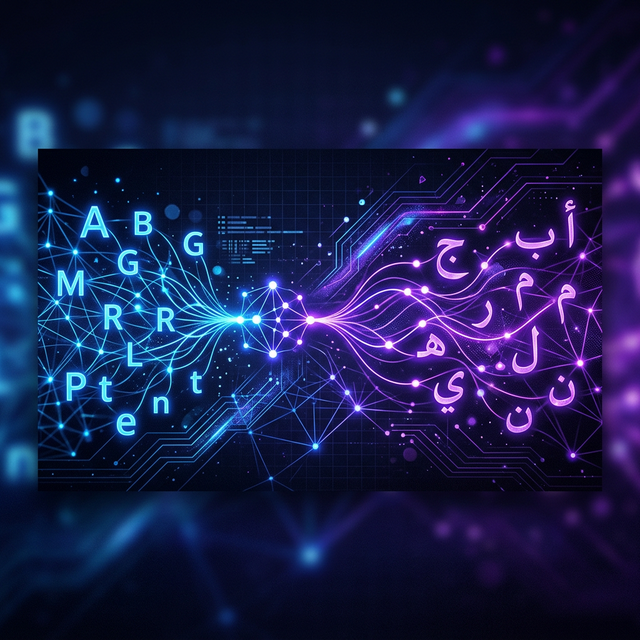
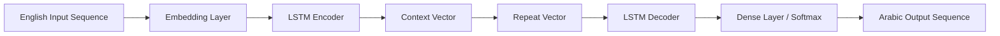

<div align="center">
  
  
  # 🌊 LinguaFlow
  ### *Advanced English-to-Arabic Neural Machine Translation*
  
  [](https://opensource.org/licenses/MIT)
  [](https://www.python.org/)
  [](https://tensorflow.org/)
  [](https://huggingface.co/Ali0044/LinguaFlow)
</div>

---

## 📖 Overview

**LinguaFlow** is a robust Sequence-to-Sequence (Seq2Seq) neural machine translation model specialized in converting English text into Arabic. Leveraging a deep learning architecture based on **LSTM (Long Short-Term Memory)**, it captures complex linguistic relationships and contextual nuances to provide high-quality translations for short-to-medium length sentences.

### ✨ Key Features
- 🚀 **LSTM-Based Architecture**: High-efficiency encoder-decoder framework.
- 🎯 **Domain Specificity**: Optimized for the `salehalmansour/english-to-arabic-translate` dataset.
- 🛠️ **Easy Integration**: Simple Python API for quick deployment.
- 🌍 **Bilingual Support**: Full English-to-Arabic vocabulary coverage (En: 6,400+ | Ar: 9,600+).

---

## 🏗️ Technical Architecture

The model employs an **Encoder-Decoder** topology designed for sequence transduction tasks.



### Configuration Highlights
| Component | Specification |
| :--- | :--- |
| **Model Type** | Seq2Seq LSTM |
| **Hidden Units** | 512 |
| **Embedding Size** | 512 |
| **Input Depth** | 20 Timesteps |
| **Output Depth** | 20 Timesteps |
| **Optimizer** | Adam |
| **Loss Function** | Sparse Categorical Crossentropy |

---

## 📊 Performance Benchmark

LinguaFlow demonstrates strong generalization capabilities on the validation set after extensive training.

| Metric | Training | Validation |
| :--- | :--- | :--- |
| **Accuracy** | 85.99% | 85.74% |
| **Loss** | 0.9594 | 1.1926 |

---

## 🚀 Getting Started

### Prerequisites
```bash
pip install tensorflow numpy pandas scikit-learn huggingface_hub
```

### Usage Example
```python
from huggingface_hub import snapshot_download
import tensorflow as tf
import numpy as np
import os
import pickle
from tensorflow.keras.preprocessing.sequence import pad_sequences

# 1. Download model and tokenizers
repo_id = "Ali0044/LinguaFlow"
local_dir = snapshot_download(repo_id=repo_id)

# 2. Load resources
model = tf.keras.models.load_model(os.path.join(local_dir, "Translation_model.keras"))

with open(os.path.join(local_dir, "eng_tokenizer.pkl"), "rb") as f:
    eng_tokenizer = pickle.load(f)

with open(os.path.join(local_dir, "ar_tokenizer.pkl"), "rb") as f:
    ar_tokenizer = pickle.load(f)

# 3. Translation Function
def translate(sentences):
    # Clean and tokenize
    seq = eng_tokenizer.texts_to_sequences(sentences)
    # Pad sequences
    padded = pad_sequences(seq, maxlen=20, padding='post')
    # Predict
    preds = model.predict(padded)
    preds = np.argmax(preds, axis=-1)
    
    results = []
    for s in preds:
        text = [ar_tokenizer.index_word[i] for i in s if i != 0]
        results.append(' '.join(text))
    return results

# 4. Try it out!
print(translate(["Hello, how are you?"]))
```

---

## ⚠️ Limitations & Ethical Notes
- **Maximum Length**: Best results are achieved with sentences up to 20 words.
- **Domain Bias**: Accuracy may vary when translating specialized technical or medical jargon not present in the training set.
- **Bias**: As with all language models, potential biases in the open-source dataset may occasionally be reflected in translations.

---

## 🗺️ Roadmap
- [ ] Implement Attention Mechanism (Bahdanau/Luong).
- [ ] Upgrade to Transformer architecture (Base/Large).
- [ ] Expand sequence length support to 50+ tokens.
- [ ] Continuous training on larger Arabic datasets (e.g., OPUS).

---

## 🤝 Contributing
Contributions are welcome! Please feel free to submit a Pull Request. For major changes, please open an issue first to discuss what you would like to change.

## 📄 License
This project is licensed under the **MIT License** - see the [LICENSE](LICENSE) file for details.

---
<div align="center">
  Developed by <a href="https://github.com/Ali0044">Ali Khalidalikhalid</a>
</div>